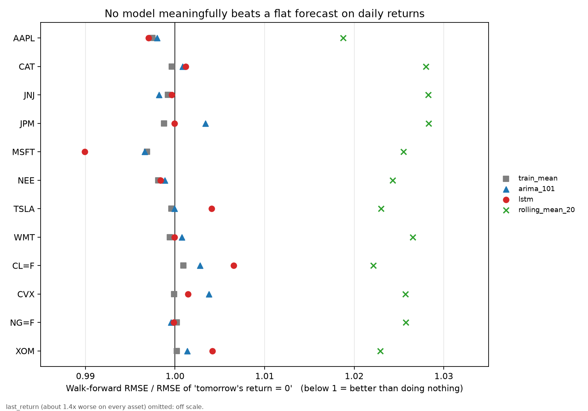

# Market Forecast Benchmark

**Can a neural network predict tomorrow's stock return? I tested that claim properly, on 12 assets, and the answer is no.**

This repo started as my MSc Data Analytics dissertation (De Montfort University, 2023), an LSTM that "predicted" Apple's share price with a low error. I rebuilt it with honest baselines, leakage-free validation and multiple-testing control. The headline result changed.

---

# Part 1: Summary for decision makers

## The question

Do machine-learning models (a neural network, a classical time-series model) forecast next-day stock and commodity returns better than trivial rules such as "tomorrow's return will be zero" or "tomorrow will look like the long-run average"?

## The answer

**No. Not on any of the 12 assets tested, in any sector.** The advanced models perform the same as doing nothing, within noise. Two intuitive rules ("tomorrow repeats today", "follow the last 20 days") are measurably worse than doing nothing.



*Each dot is a model on one asset. The vertical line is a "return = 0" forecast. Dots to the left would be better than doing nothing. They cluster on the line, within about 0.5 percent, with no pattern that survives statistical testing.*

| Finding | Evidence |
|---|---|
| Neural network (LSTM) is no better than predicting the historical average | Indistinguishable on every asset; AAPL p = 0.75 vs average forecast |
| Classical ARIMA is no better either | Same range as LSTM |
| Yesterday's return is a bad predictor | About 40 to 49 percent more error on every asset, statistically certain |
| 20-day moving average is a bad predictor | About 2 to 3 percent more error on every asset, statistically certain |
| The one apparent win (LSTM on MSFT, 0.7 percent better) is a fluke | Disappears after correcting for 35 simultaneous comparisons (adjusted p = 1.0) |

## Why the original dissertation looked impressive

The original model predicted the **price level**. Today's price is already an excellent guess for tomorrow's, so any model looks accurate on price. Measured on what matters (the day-to-day **return**), the skill is zero. The original run also used a single train/test split, one training pass, and fitted its scaling on data that included the test period, so the headline error was not reproducible (2.54 reported, 2.81 on re-run).

## What this means in practice

- A forecasting project on daily returns of liquid assets should not be funded on the expectation of predictive edge from model complexity. The complex model costs orders of magnitude more compute than the average forecast and returns nothing extra.
- Evidence standards matter more than model choice. Without baselines, a held-out walk-forward test and multiple-testing control, a noise result can be presented as success.
- Where models plausibly do add value is a different target: **risk** (volatility) rather than direction. That is the next phase.

## How sure am I

Fairly sure about "no edge for this model family on daily returns, 2013 to 2023". Not claiming "no signal exists anywhere". Limits:

- One LSTM configuration, deliberately not tuned after seeing results (tuning on seen folds would inflate any finding).
- Daily horizon, price-only inputs.
- This is a research benchmark, not investment advice and not a trading backtest. No transaction costs, no execution.

---

# Part 2: Engineering detail

## Contents

- [Design](#design) 
- [Results](#results)
- [Methods](#methods)
- [Data caveats](#data-caveats)
- [Limitations](#limitations)
- [Reproduce](#reproduce)
- [Repo layout](#repo-layout)
- [Status and roadmap](#status-and-roadmap)

## Design

Every model is evaluated under one contract so comparisons are fair.

- **Target:** next-day log return, `r_t = ln(P_t / P_{t-1})`, on split and dividend adjusted close.
- **Validation:** expanding-window walk-forward. First 756 trading days (about 3 years) for initial training, then 63-day test blocks, refit every block. About 30 folds per asset. Train indices are strictly before test indices (enforced by a unit test).
- **Prediction contract:** one-step-ahead. The prediction for day `t` uses information up to `t-1` only, for every model, including ARIMA (fixed parameters from train, state updated with observed test data via `append(refit=False)`).
- **Single results table** for all assets, tidy format: `ticker, sector, model, fold, rmse, mae, dir_acc, up_rate`.

### Models

| Model | Meaning |
|---|---|
| `zero` | Forecast 0 (random walk in price) |
| `train_mean` | Mean return of the training window (captures drift only) |
| `last_return` | Persistence: tomorrow = today |
| `rolling_mean_20` | Mean of last 20 returns |
| `arima_101` | ARIMA(1,0,1) with constant, refit per fold |
| `lstm` | One LSTM layer, 32 units, window 60, Dense(1). Adam, MSE, batch 64, max 30 epochs, early stopping (patience 3) on a chronological 10 percent validation tail, `seed=42`. Inputs standardised with **train-only** mean and std |

### Fixes relative to the dissertation

| Dissertation flaw | Fix here |
|---|---|
| Predicted price level | Predicts log return |
| No baseline | Five baselines under identical folds |
| Single 95/5 split | Walk-forward, about 30 folds |
| Scaler fit on full data (leakage) | Scaler from train only, per fold |
| 1 epoch, no seed, not reproducible | Early stopping, fixed seed |
| RMSE only | RMSE, MAE, directional accuracy, ratio vs zero |
| One ticker | 12 assets (equities and futures) |
| No significance testing | Paired fold tests with Holm correction |

## Results

Metric: walk-forward RMSE divided by RMSE of the `zero` forecast (`rmse_vs_zero`). Below 1 beats zero.

**LSTM across assets** (full tables in `reports/`)

| Stage | Assets | LSTM `rmse_vs_zero` range |
|---|---|---|
| 1 | AAPL | 0.9971 |
| 2 | MSFT, JPM, JNJ, WMT, CAT, NEE, TSLA | 0.9899 (MSFT) to 1.0041 (TSLA) |
| 3 | XOM, CVX, CL=F, NG=F | 0.9998 (NG=F) to 1.0065 (CL=F) |

Across all 12 assets: `last_return` 1.41 to 1.49, `rolling_mean_20` 1.019 to 1.028, `train_mean` 0.997 to 1.001.

**Directional accuracy** never meaningfully exceeds `up_rate` (share of up days, equal to an always-up forecast). Best gap observed: +1.7 points (NG=F, ARIMA), with RMSE ratio 0.9996. Treat as untested chance until corrected.

### Significance

Per asset, fold-level RMSE of each model is compared with the `train_mean` baseline (isolates skill beyond drift):

- paired t-test and Wilcoxon signed-rank on the 30 fold differences
- **Holm correction across all (asset, model) tests in a stage**

Stage 2 (7 assets, 35 tests): zero models beat `train_mean` after correction. `last_return` and `rolling_mean_20` are significantly worse on every asset (adjusted p near 0, except TSLA `rolling_mean_20`, 1e-5). LSTM vs `train_mean` on AAPL: 13 of 30 folds better, p = 0.75 (t-test), 0.95 (Wilcoxon).

Stage 3 (4 assets, 20 tests): same outcome. No model beats `train_mean` after Holm correction. Smallest adjusted p among the other models is 0.21 (CVX ARIMA, which is worse than the mean, not better). `last_return` and `rolling_mean_20` are significantly worse on all four assets (adjusted p up to 4e-5). On CL=F, `zero` beats `train_mean` by 0.09 percent (raw p 0.03, adjusted 0.84), so drift sign is unstable for crude.

## Methods

Why compare with `train_mean` and not only `zero`: stock returns carry positive drift, so predicting the mean beats predicting zero by up to about 0.3 percent. LSTM, ARIMA and `train_mean` all collect that same gain on the same folds. The relevant question for the network is whether it adds anything beyond the mean, and it does not.

Why Holm: with 7 assets by 5 models there are 35 tests per stage. At 5 percent, about 2 false positives are expected. The MSFT LSTM result (raw p 0.13 / 0.21) is the type of event that gets reported without correction.

## Data caveats

- Source: `yfinance`, auto-adjusted prices, 2013-01-01 to 2023-07-31 (same window as the dissertation). Cached to `data/raw/` as parquet; the cache is gitignored, so a re-download after provider adjustments can shift numbers slightly.
- `CL=F` (WTI crude front-month) has a **negative settle on 2020-04-20**. `log` of a negative price is undefined; that return and the next are dropped (`CL=F: 2656 returns` vs 2660 for equities; the rest is likely trading-calendar differences).
- `CL=F` and `NG=F` are **continuous front-month futures**. Roll days create artificial return jumps. Results for them are indicative only.
- Stage 4 (rare earth proxies: REMX, MP, LYC.AX) **skipped**: MP has too little history for a 3-year burn-in plus walk-forward, and equity proxies are not metal spot prices, which are paywalled.

## Limitations

- Walk-forward folds share training history, so fold results are correlated and the paired tests overstate independence. P-values are optimistic. This makes the null conclusion conservative: if anything the tests would find too much signal, not too little.
- One architecture, one window, no hyperparameter search, by design. A tuned or richer model (features, volatility regimes, cross-asset inputs) is a different experiment.
- 30 folds gives low power against tiny effects. The claim is "no effect large enough to matter", not "exactly zero".
- No trading simulation. Even a real statistical edge would need cost-adjusted backtesting.

## Reproduce

Python 3.10 to 3.12 (TensorFlow). Developed on Windows (Git Bash); unit tests also pass on Linux.

```bash
python -m venv .venv
source .venv/bin/activate            # Git Bash on Windows: source .venv/Scripts/activate
pip install -r requirements.txt
pip install -e .
pytest                                # leakage and fold-coverage tests

python scripts/run_baselines.py --stage 1 --lstm      # AAPL
python scripts/run_baselines.py --stage 2 --lstm      # 7 sectors, about 20 min
python scripts/run_baselines.py --stage 3 --lstm      # oil and gas
python scripts/compare_models.py reports/results_folds_lstm_stage2.csv train_mean
python scripts/make_figure.py
```

Runtime is dominated by LSTM refits (about 2 to 3 minutes per asset on CPU). Assets are defined in `configs/universe.yaml`; no ticker is hardcoded in code.

## Dashboard

Interactive view of all results (no model runs, reads `reports/`):

```bash
pip install -r app/requirements.txt
streamlit run app/dashboard.py
```

Live: https://market-forecast-benchmark.streamlit.app/

## Repo layout

```
configs/universe.yaml        assets per stage, date window
src/mfb/data.py              loader with parquet cache, log returns
src/mfb/splits.py            walk-forward splitter
src/mfb/models.py            baseline models (one-step-ahead contract)
src/mfb/lstm.py              seeded LSTM, train-only scaling
src/mfb/eval.py              metrics, runner, summary
scripts/run_baselines.py     run a stage
scripts/compare_models.py    paired tests, Holm correction
scripts/make_figure.py       summary figure
tests/                       leakage, folds, sequence builder
notebooks/00_dissertation_original.ipynb   untouched original, for comparison
reports/                     per-fold and summary CSVs, figures
```

## Status and roadmap

- [x] Phase 0: original dissertation notebook preserved untouched
- [x] Phase 1: baselines, walk-forward, leakage-free LSTM, tests
- [x] Phase 2: 7-sector extension with Holm-corrected paired tests
- [x] Phase 3: oil and gas, point estimates
- [ ] Phase 4: rare earth proxies (skipped, see data caveats)
- [ ] Next: **volatility forecasting** (GARCH, HAR vs gradient boosting and LSTM) where predictability is known to exist; engineered features with SHAP; up/down classifier with AUC and a cost-adjusted backtest

*Not investment advice.*
